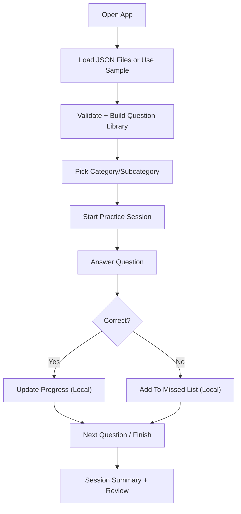

## 1. Product Overview
A web app for practicing English grammar via multiple-choice questions stored in local JSON files.
It helps learners study by category/subcategory, get instant explanations, and track progress over time.

## 2. Core Features

### 2.1 User Roles
Not required. Single-user, local usage.

### 2.2 Feature Module
1. **Library**: load question banks from multiple JSON files, browse categories and subcategories
2. **Practice**: quiz sessions with configurable question count and behavior
3. **Review**: see wrong answers and explanations, retry missed questions
4. **Progress**: local statistics by category/subcategory (accuracy, attempts, streaks)

### 2.3 Page Details
| Page Name | Module Name | Feature description |
|-----------|-------------|---------------------|
| Home / Library | Data source | Choose data source: built-in sample set, local file upload (multiple .json), drag-and-drop |
| Home / Library | Catalog | Category + subcategory list, counts, search, filters |
| Practice | Session setup | Select category/subcategory, number of questions, randomization, include/exclude previously mastered items |
| Practice | Question runner | Show question, 4 options, submit, immediate feedback, next/previous |
| Practice | Explanation | Show correct answer and explanation text after submit (toggle auto-show) |
| Review | Missed list | List missed questions for the last session and “all-time missed” |
| Review | Retry mode | Quick retry loop using missed questions only |
| Progress | Stats overview | Accuracy, total answered, per-category breakdown, trends (lightweight) |
| Settings | Data mapping | Validate JSON schema, show errors, allow mapping if keys differ (optional) |

## 3. Core Process
User flow (typical):
1. User opens app and loads one or more JSON files containing questions.
2. App validates and merges questions into a library, grouped by category/subcategory.
3. User selects a category/subcategory and starts a practice session.
4. User answers questions; app reveals correctness and explanation.
5. App records results locally and provides a review list of mistakes and progress stats.

## 4. User Interface Design

### 4.1 Design Style
- Design direction: editorial study tool with “workbook” feel (paper texture, sharp typography, confident accent color)
- Primary colors: warm off-white background, ink-black text, one strong accent (e.g., vermilion or cobalt)
- Button style: high-contrast, slightly rounded, hover shift + subtle shadow
- Typography: distinctive serif or slab for headings + readable sans for body
- Layout: desktop-first split layout (catalog left, details right) + full-screen practice mode
- Icons: minimal inline symbols; avoid heavy icon packs

### 4.2 Page Design Overview
| Page Name | Module Name | UI Elements |
|-----------|-------------|-------------|
| Home / Library | Catalog | Left panel list with counts, search bar, filter chips, selected state |
| Practice | Question runner | Large question card, answer grid, keyboard hints (1-4), progress bar |
| Practice | Explanation | Collapsible “Why” panel with typographic emphasis |
| Review | Missed list | Table-like cards with “retry” CTA |
| Progress | Stats overview | Simple charts/bars, per-category accuracy pills |

### 4.3 Responsiveness
Desktop-first.
- Tablet: collapse catalog into drawer, keep practice full-width.
- Mobile: single-column, larger tap targets, option buttons stacked.

