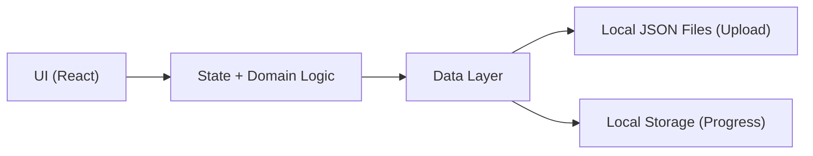

## 1. Architecture Design



## 2. Technology Description
- Frontend: React@18 + TypeScript + tailwindcss@3 + vite
- Initialization Tool: Vite
- Backend: None (client-only)
- Data: Local JSON upload and optional bundled sample dataset; user progress stored in localStorage

## 3. Route Definitions
| Route | Purpose |
|-------|---------|
| / | Library + entry point |
| /practice | Practice session runner |
| /review | Missed questions and retry |
| /progress | Stats and history |
| /settings | Data validation and preferences |

## 4. API Definitions
No backend APIs.

## 5. Data Model

### 5.1 Type Definitions (Frontend)
```ts
export type Question = {
  category: string;
  subcategory: string;
  question: string;
  options: string[];
  correctAnswer: string;
  explanation: string;
};

export type QuestionId = string;

export type AnswerRecord = {
  questionId: QuestionId;
  chosen: string;
  correct: boolean;
  answeredAt: string;
  category: string;
  subcategory: string;
};

export type ProgressSnapshot = {
  version: 1;
  answered: Record<QuestionId, { attempts: number; correct: number; lastAnsweredAt: string }>;
  missed: Record<QuestionId, { count: number; lastMissedAt: string }>;
};
```

### 5.2 JSON Ingestion and Validation Rules
- Accepts either:
  - An array of question objects in a JSON file, or
  - Newline-delimited JSON objects (NDJSON) if provided (optional)
- Validation requirements:
  - category/subcategory/question/explanation are non-empty strings
  - options is an array with length >= 2
  - correctAnswer is one of the options
- Invalid items are skipped with a visible validation report (file name, index, error message)

### 5.3 Deterministic Question ID
- Use a stable ID derived from normalized fields: category + subcategory + question text
- Rationale: allows progress to persist even if file ordering changes

